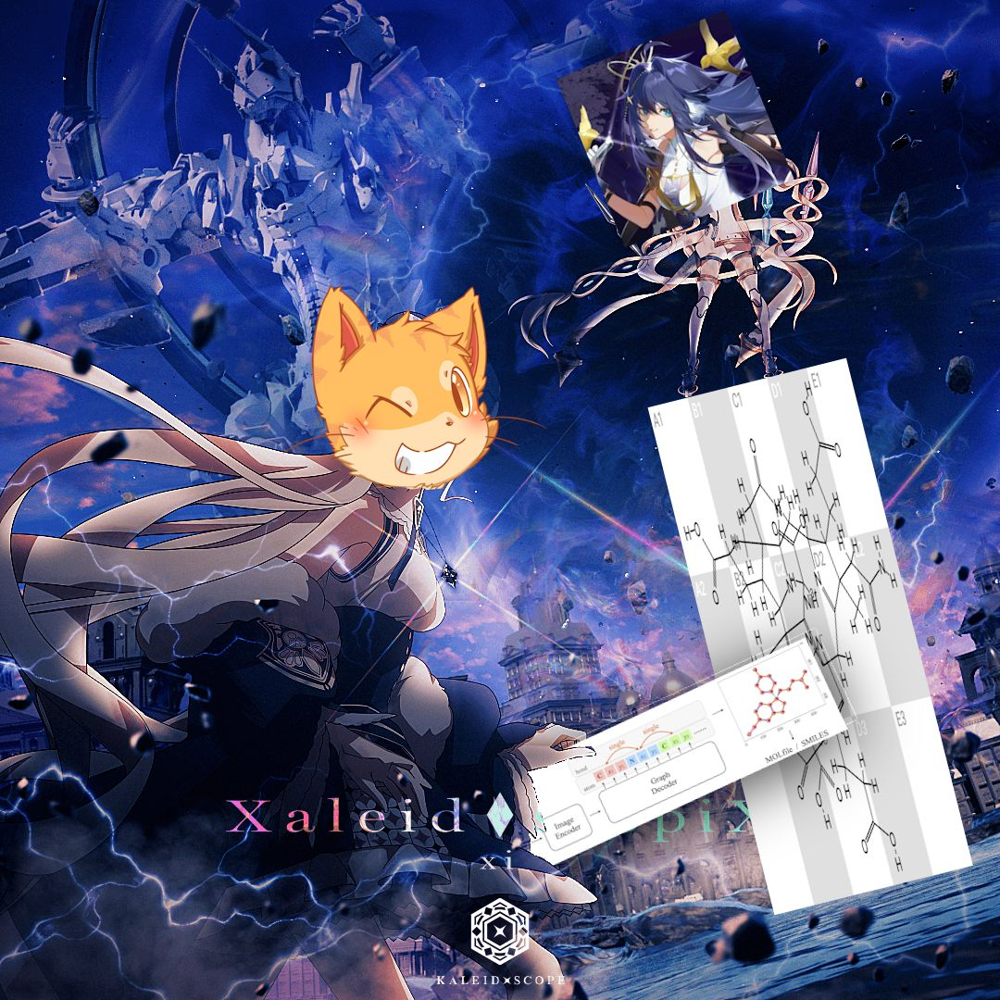

# Lost One's Chiral | Lost One 的手性碳

> This is the source code repository.  
> To use the tool and read the full article about the "Chiral Carbon CAPTCHA", please visit the main website:
> # [lostone.catme0w.org](https://lostone.catme0w.org)

A Proof of Concept designed to dismantle the illusion of security provided by the 'chiral carbon' test.

## Resources

* Main Site: [lostone.catme0w.org](https://lostone.catme0w.org)
* Hugging Face Space: [catme0w/MolScribe-Long](https://huggingface.co/spaces/catme0w/MolScribe-Long)
* Model Weights: [catme0w/MolScribe-Long](https://huggingface.co/catme0w/MolScribe-Long)
* Base Model: [MolScribe](https://pubs.acs.org/doi/10.1021/acs.jcim.2c01480)

---

*Credits: [Xaleid◆scopiX](https://www.youtube.com/watch?v=-PTe8zkYt9A)*
